# 实验三

​		实验环境：win10 idea+wsl

​		首先下载安装HBase，在hbase-env.sh中配置JAVA_HOME。

## HBase单机运行

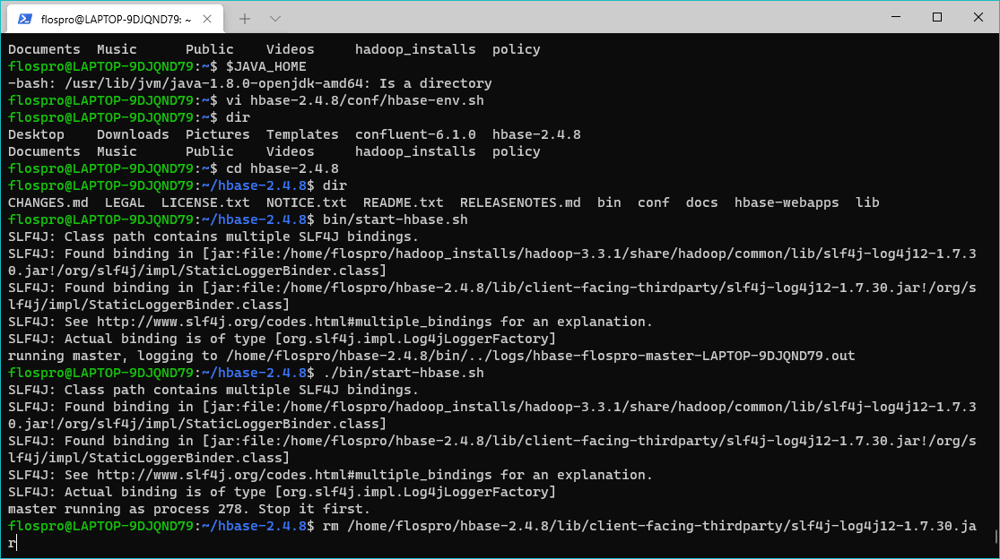

​		启动后发现多了一个slf4j，但是实际上应该不影响运行，实际操作时直接删除了HBase的slf4j。

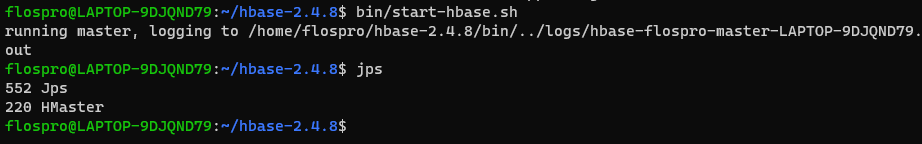

​		启动HBase，发现启动失败，并且无法打开WebUI，这是因为没有事先启动HDFS。如果此时尝试直接启动HDFS，HBase仍然无法打开，这是因为违背了启动逻辑，会把HBase的部分进程顶掉。按照正常顺序可以启动。

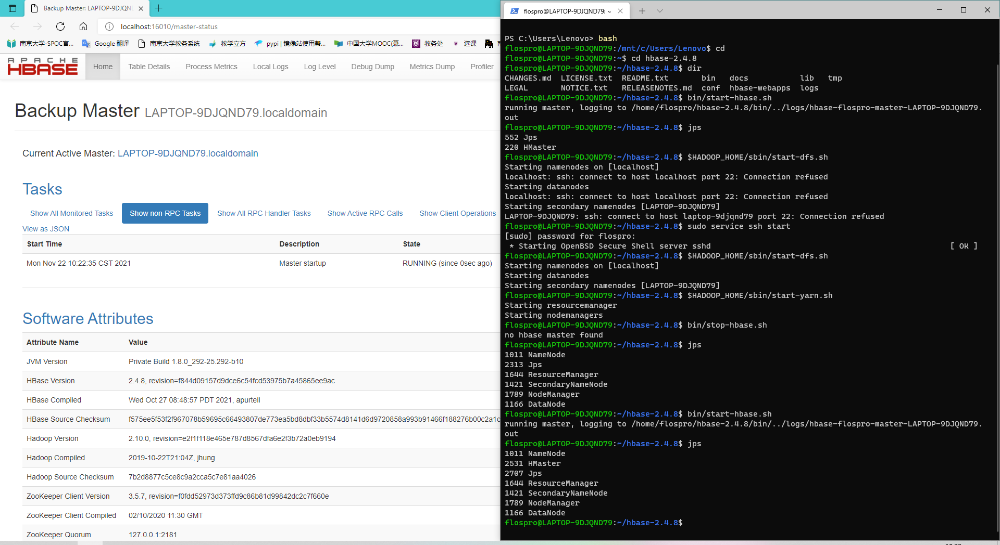

​		关闭单机HBase，会发现关闭非常的慢。可以改为下面两个命令加速stop进程。

```shell
bin/hbase-daemon.sh stop master
bin/hbase-daemon.sh stop regionserver
```

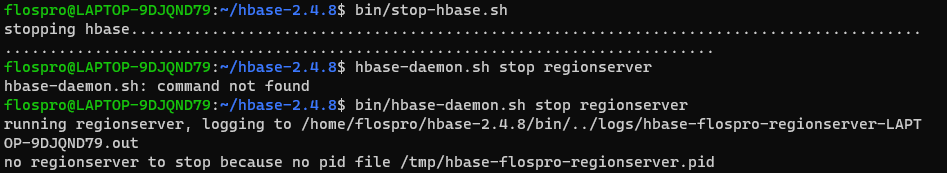

## HBase伪分布式运行

​		首先修改配置文件，经检查hadoop下面的fs.defaultFS是hdfs://localhost:9000，修改hbase-site.xml。

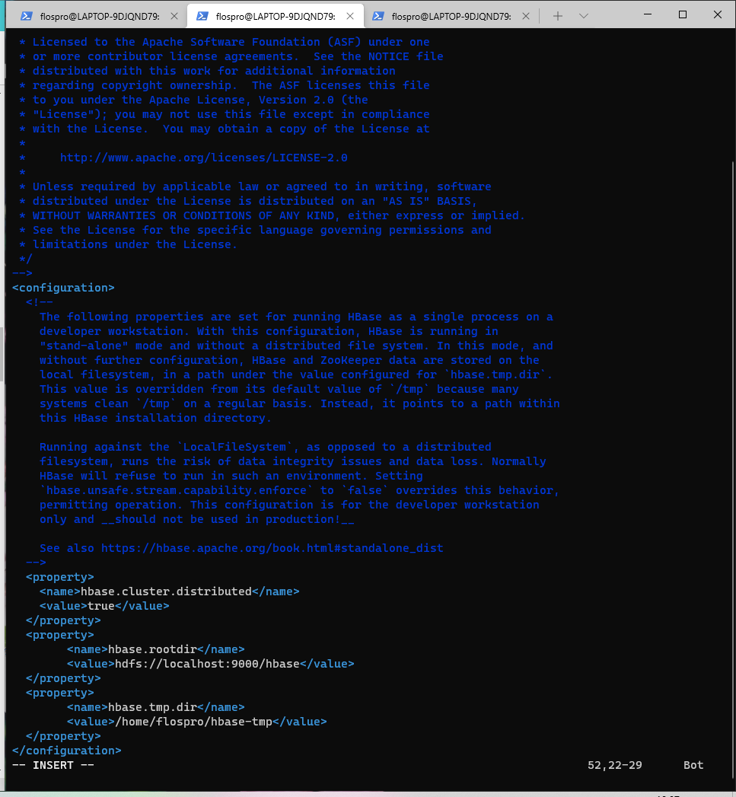

​		可以发现WebUI和dfs集群文件正常。

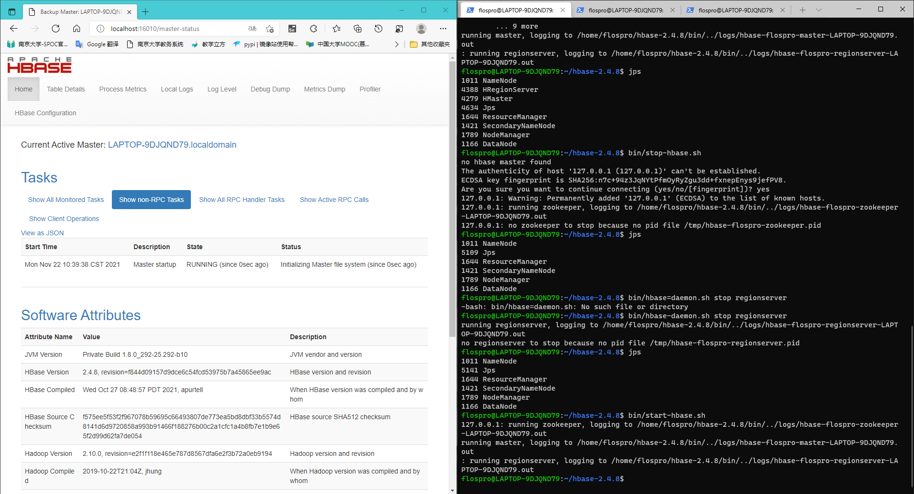

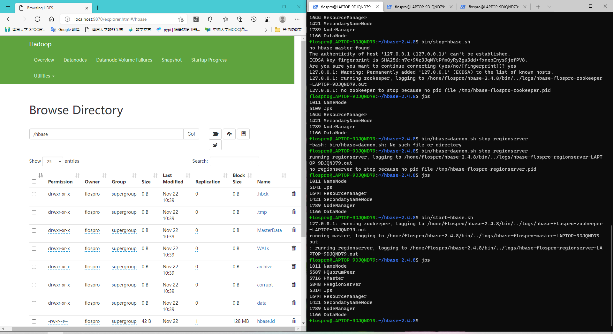

​		使用bin/hbase shell成功进入shell：

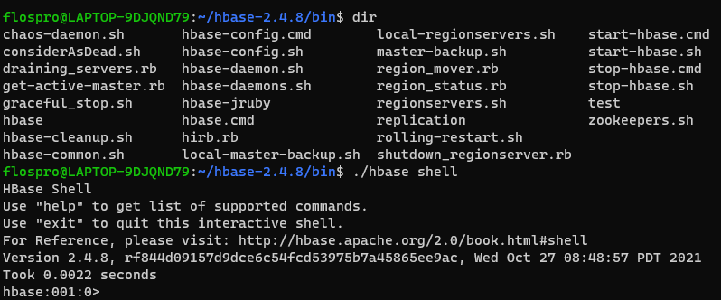

​		但是无法进行创建表格等基本操作：

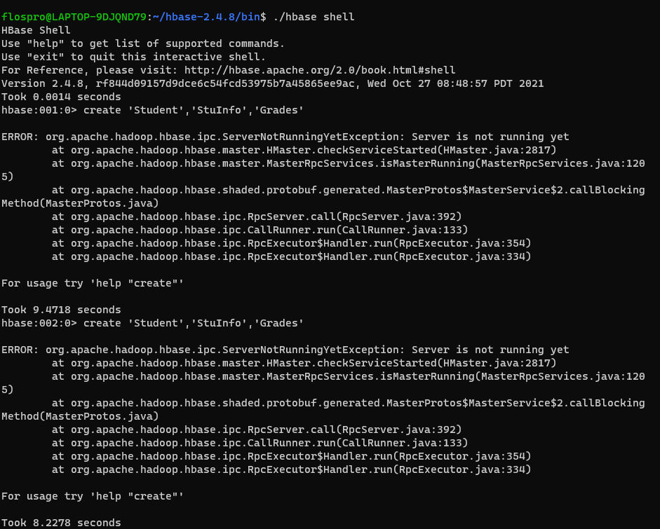

​		这个报错并没有在网上直接找到好的解决方法，于是直接想到的就是先尝试改用外置ZooKeeper。首先下载外置ZooKeeper：

```shell
wget https://mirrors.nju.edu.cn/apache/zookeeper/zookeeper-3.6.3/apache-zookeeper-3.6.3-bin.tar.gz
```

​		在hbase-env.sh中禁用内部zk：

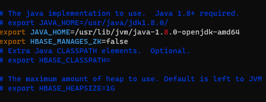

​		修改hbase-site.xml:

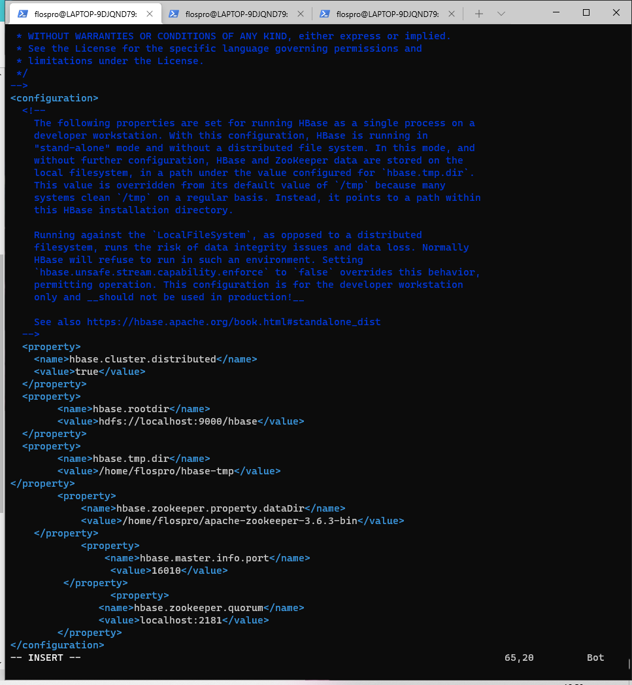

​		复制配置文件样例，编辑zoo.cfg，将dataDir设置在zk目录下的data文件夹中：

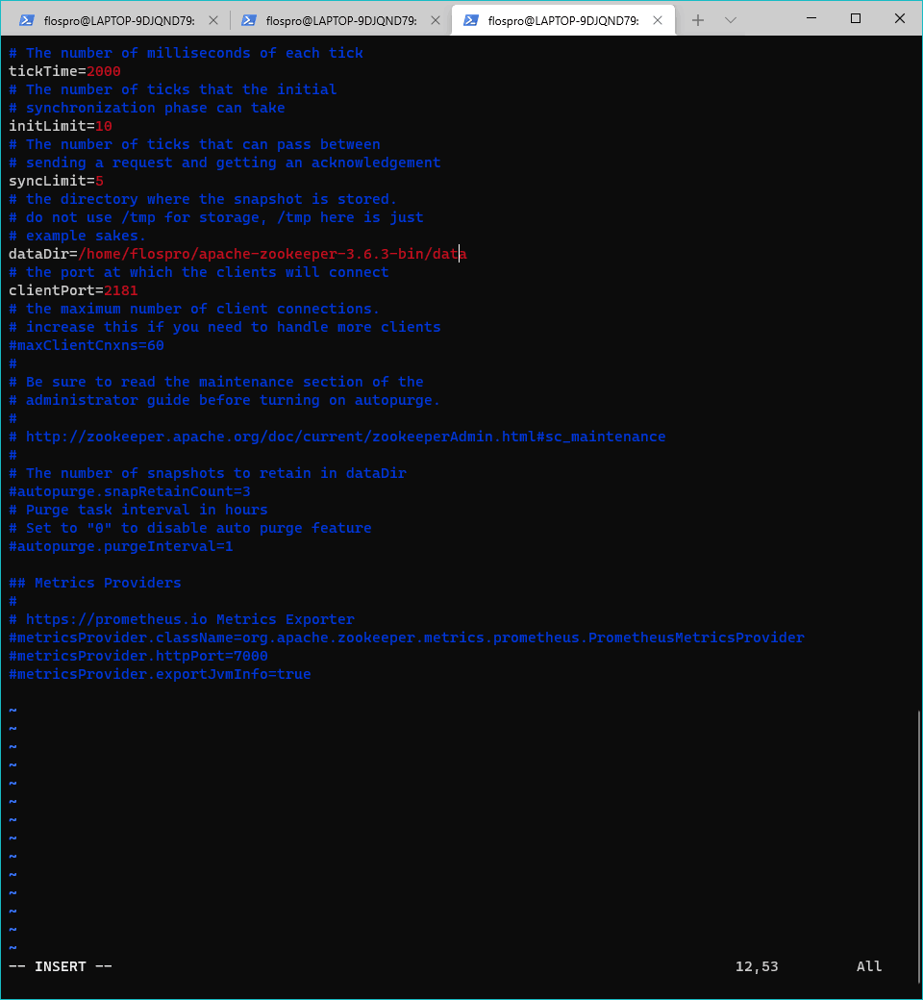

​		启动HBase前，首先启动zk：

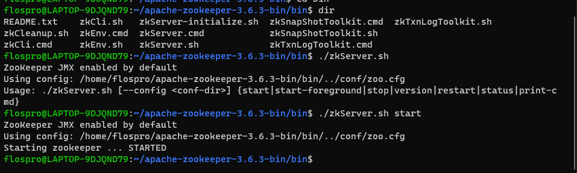

​		外置zk配置成功，参考：

http://blog.iis7.com/article/39306.html
https://www.iteye.com/blog/qindongliang-1978485
https://www.cnblogs.com/rgever/p/10222167.html

​		但是对解决问题没有任何帮助。

​		再次搜索资料发现，在hbase-site.xml中似乎需要补充配置数据，WAL(Write-Ahead-Log)需要指定写入模式(WALFactory)，有defaultProvider、asyncfs、filesystem、multiwal四种选项。

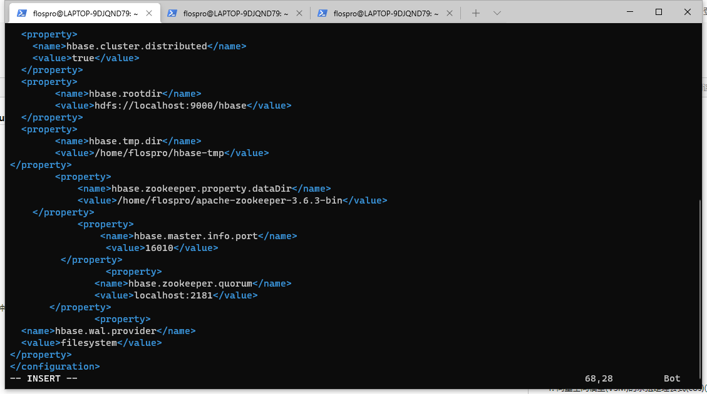

​		此时发现可以正常进行HBase的shell操作。参考https://www.cnblogs.com/live41/p/15497029.html。

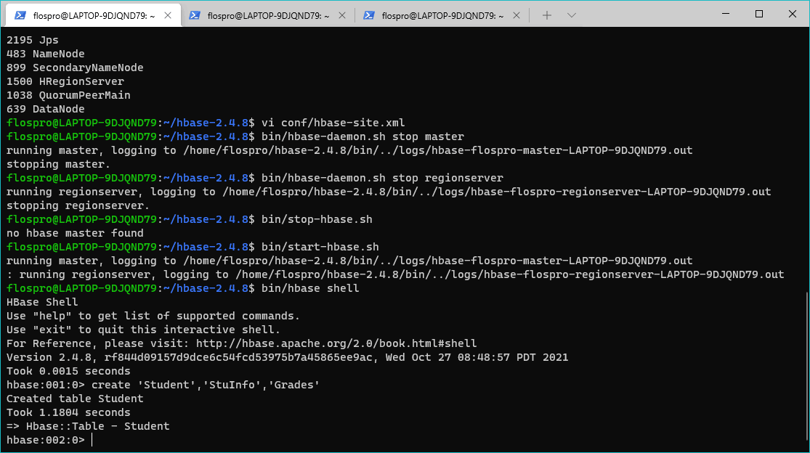

​		顺手把HBase和zk加入环境变量：

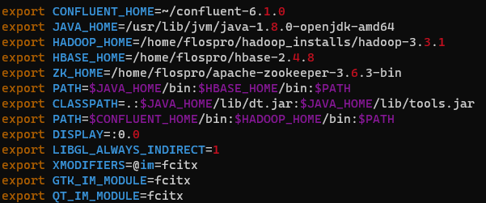

## Java代码逻辑

​		首先根据关系型数据表格，设计适合HBase的列族数据表格：

​		原表格共三张，为学生表、课程、选课表。课程表实际上是一张2NF的表，每一行的三个属性高度绑定，若出现其中一个必然绑定另外两个固有属性同时出现，因此如果把这张表的内容作为另一张大表的一部分，一定会出现数据冗余。因此在HBase中，针对原有数据内容这里设计了两张表，一张是学生表和选课表的join（SC表），一张是原有的课程表：

<table>
    <tr>
        <td rowspan="3">行键</td>
        <td colspan="3">列族 StuInfo</td>
        <td colspan="3">列族 Grades</td>
    <tr>
    <tr>
        <td>S_Name</td>
        <td>S_Sex</td>
        <td>S_Age</td>
        <td>123001</td>
        <td>123002</td>
        <td>123003</td>
    <tr>
    <tr>
        <td>2015001</td>
        <td>Li Lei</td>
        <td>male</td>
        <td>23</td>
        <td>86</td>
        <td></td>
        <td>69</td>
    <tr>
    <tr>
        <td>2015002</td>
        <td>Han Meimei</td>
        <td>female</td>
        <td>22</td>
        <td></td>
        <td>77</td>
        <td>99</td>
    <tr>
    <tr>
        <td>2015003</td>
        <td>Zhang San</td>
        <td>male</td>
        <td>24</td>
        <td>98</td>
        <td>95</td>
        <td></td>
    <tr>
</table>
因为空cell不占用存储，所以Grades下课程多少都没关系。

<table>
    <tr>
        <td rowspan="3">行键</td>
        <td colspan="2">列族 C_Info</td>
    <tr>
    <tr>
        <td>C_Name</td>
        <td>C_Credit</td>
    <tr>
    <tr>
        <td>123001</td>
        <td>Math</td>
        <td>2.0</td>
    <tr>
    <tr>
        <td>123002</td>
        <td>Computer Science</td>
        <td>5.0</td>
    <tr>
    <tr>
        <td>123003</td>
        <td>English</td>
        <td>3.0</td>
    <tr>
</table>

### 具体实现

在idea的run configuration中选择run on在wsl上，同时也已启动wsl上的HBase后，首先连接HBase：

```java
public static void getConnect() throws IOException {
        conf=HBaseConfiguration.create();
        try{
            connection=ConnectionFactory.createConnection(conf);
            System.out.println("Connect to HBASE successfully");
        } catch (IOException e) {
            e.printStackTrace();
        }
    }
```

1. #### **设计并创建合适的表；**

   ​		设计见上。

   ​		创建表格使用函数：

   ```java
   public static void createTable(String table, String[] familyNames) throws IOException{
           TableName tableName = TableName.valueOf(table);
           Admin admin = connection.getAdmin();
           if(admin.tableExists(tableName)) {
               admin.disableTable(tableName);
               admin.deleteTable(tableName);
               System.out.println("Table '"+tableName.toString() + "' is exist, it will be deleted and recreated");
           }
               System.out.println("start create table '"+table+"'");
               HTableDescriptor tdesc = new HTableDescriptor(tableName);
               for (String familyName : familyNames) {
                   tdesc.addFamily(new HColumnDescriptor(familyName));
               }
               admin.createTable(tdesc);
               System.out.println("create table '"+table+"' successfully");
               admin.close();
       }
   ```

   ​		为了方便反复试验，首先判断将要创建的表格是否存在，若存在则删除重建。函数通过传入表名和列族名（字符数组）执行。

   ​		插入数据使用函数：

   ```java
   public static void addData(String tableName, String rowKey, String family, String column, String value) throws IOException {
           Table table = connection.getTable(TableName.valueOf(tableName));
           Put put = new Put(Bytes.toBytes(rowKey));
           put.addColumn(Bytes.toBytes(family), Bytes.toBytes(column), Bytes.toBytes(value));
           table.put(put);
           System.out.println("put " + rowKey + " | " + family + " => "+column + " : " + value + " to table " + tableName + " successfully");
       }
   ```

   ​		传入表名、行键、列族、列、值作为参数。

   ​		为了检查是否成功创建表格并插入数据，构造scan函数查看表格，其中cellDecoder函数为格式化输出函数，参数为表名：

   ```java
     public static void scan(String tableName) throws IOException {
           System.out.println("show table '"+tableName +"' status:");
           Table table = connection.getTable(TableName.valueOf(tableName));
           ResultScanner scanner = table.getScanner(new Scan());
           for (Result result : scanner) {
               byte[] row = result.getRow();
               System.out.println("row key is: " + new String(row));
               cellDecoder(result);
           }
           System.out.println("that's the case & continue next step\n");
           scanner.close();
       }
   ```

2. #### **查询选修Computer Science的学生的成绩；**

   ​		由于HBase中是两张表，SC表中课程数据是列限定符且为课程号，所以需要进行一次嵌套查询。首先在课程表中查询CS课程对应的课程号，结果作为字符数组返回，再在SC表中查询数组中所有元素对应的列限定符所在的行，返回这些行的结果。具体来说：

   ```java
   public static String[] colFilter(String tableName, String colFamily, String col, String value) throws IOException {
           System.out.println("start filtering table '"+tableName +"' for specific "+colFamily+"~"+col+":"+value+":");
           Table table = connection.getTable(TableName.valueOf(tableName));
           Scan scan = new Scan();
           SingleColumnValueFilter filter = new SingleColumnValueFilter(Bytes.toBytes(colFamily),Bytes.toBytes(col), CompareFilter.CompareOp.EQUAL, Bytes.toBytes(value));
           scan.setFilter(filter);
           ResultScanner scanner = table.getScanner(scan);
           List<String> ansRowKey = new ArrayList<String>();
           for (Result result : scanner) {
               for (Cell cell : result.rawCells())
                   ansRowKey.add(new String(CellUtil.cloneRow(cell)));
           }
           Set set = new HashSet();
           set.addAll(ansRowKey);
           ansRowKey.clear();
           ansRowKey.addAll(set);
           String ans[] = ansRowKey.toArray(new String[ansRowKey.size()]);
           for(int i = 0; i < ans.length; i++)
               System.out.println(ans[i]+" satisfies the filter");
           scanner.close();
           return ans;
       }
   ```

   ​		首先查询课程号，函数以表名、列族、列、值作为参数，对scan操作施加过滤器**SingleColumnValueFilter**，比较符为“=”，作用是在指定的列族和列中进行值相等的比较，即查找C_Info中的C_Name等于Computer Science的行。

   ​		需要注意的是，这里的对查询结果的cell进行遍历时，由于一个逻辑行拥有多个cell，对result遍历记录行键时结果会多次记录，需要去重，比如将数族转化为集合再转化回来。这样得到结果以字符数组形式传回。

   ```java
   public static void qualFilter(String tableName, String family, String colName) throws IOException {
           System.out.println("start filtering table '" + tableName + "' for specific colName:" + colName + ":");
           Table table = connection.getTable(TableName.valueOf(tableName));
           Scan scan = new Scan();
           scan.setFilter(new QualifierFilter(CompareOperator.EQUAL, new BinaryComparator(Bytes.toBytes(colName))));
           ResultScanner scanner = table.getScanner(scan);
           for (Result result : scanner) {
               for (Cell cell : result.rawCells()) {
                   System.out.println("filtered student " + new String(CellUtil.cloneRow(cell)) + " get "+new String(CellUtil.cloneValue(cell))+" in "+ colName);
               }
           }
           scanner.close();
       }
   ```

   ​		接下来通过for循环遍历上一步查询结果的数组，传入表名、列族和得到的结果执行父查询，虽然实际上我们了解数组中其实只有一个元素但我们仍需标准一点使用数组和循环。

   ​		由于表格设计中课程号的信息存储在列限定符中，使用**QualifierFilter**过滤器筛选查询结果，比较符为“=”，比较器为**BinaryComparator**比较完整字节数组，此时我们得到的结果只有一个个列限定符为123002（CS课程号）的cell，非常干净没有其他数据，cell的行键即为学号，cell内的值即为成绩，可以在遍历时直接格式化输出。

3. #### **增加新的列族和新列Contact:Email，并添加数据；**

   ​		HBase中列族不能直接添加，需要借助admin的接口添加。据悉，较新版本的HBase增加列族不需要事先diable表格：

   ```java
   HColumnDescriptor newFamliy = new HColumnDescriptor("Contact");
   Admin admin = connection.getAdmin();
   admin.addColumn(TableName.valueOf("Students"), newFamliy);
   admin.close();
   ```

   ​		之后调用addData函数即可。

4. #### **删除学号为2015003的学生的选课记录；**

   ​		删除选课记录，在原关系型数据库表格中不考虑将选课表拆分成更高范式的情况下相当于直接删除选课表中对应学号的所有数据（若可拆分，则是可以保留成绩的，否则成绩也会一并抹去，两种情况都是合理的需求情况）。

   ​		在HBase中，选课表已经和学生表绑定且所有数据存在Grades列族中，故删除选课记录对应的就是删除特定行键对应的Grades列族下的所有数据。实现函数：

   ```java
   public static void deleteRow(String tableName, String rowKey, String colFami) throws IOException {
           System.out.println("start filtering table '" + tableName + "' to find specific student " + rowKey + ":");
           Table table = connection.getTable(TableName.valueOf(tableName));
           Scan scan = new Scan();
           FilterList allFilters = new FilterList(FilterList.Operator.MUST_PASS_ALL);
           allFilters.addFilter(new FamilyFilter(CompareOperator.EQUAL, new BinaryComparator(Bytes.toBytes(colFami))));
           allFilters.addFilter(new RowFilter(CompareFilter.CompareOp.EQUAL, new RegexStringComparator(rowKey)));
           scan.setFilter(allFilters);
           ResultScanner scanner = table.getScanner(scan);
           for (Result result : scanner){
               for (Cell cell : result.rawCells()) {
                   Delete d = new Delete(result.getRow());
                   d.addFamily(Bytes.toBytes(colFami));
                   table.delete(d);
               }
               System.out.println("Row " + rowKey +" column family " + colFami +" from table " + tableName + " deleted");
           }
           scanner.close();
       }
   ```

   ​		传入表名、行键、列族进入函数。删除的方法就是找到所有满足条件的cell，然后调用delete方法删除。有两点需要注意：

   1. 要找到所有满足条件的cell，需要满足行键正确，列族名正确两个过滤条件，此时scan的过滤器应该使用继承于抽象类Filter的Filterlist类，设置这个综合过滤器的过滤条件为构成其的子过滤器的交，即**MUST_PASS_ALL**（对应MUST_PASS_ONE则是并），构成它的两个过滤器一个过滤行键、一个过滤列族。

      过滤行键的过滤器为**RowFilter**，针对列族进行过滤的过滤器为**FamilyFilter**，这里两个比较符都为“=”，比较器为**BinaryComparator**比较完整字节数组或者**RegexStringComparator**匹配正则表达式等在这里都能得到正确结果，以前者更符合实际意义。

      参考：[java - HBase: How to specify multiple prefix filters in a single scan operation - Stack Overflow](https://stackoverflow.com/questions/41074213/hbase-how-to-specify-multiple-prefix-filters-in-a-single-scan-operation)

      [Hbase FilterList使用总结 - Syn良子 - 博客园 (cnblogs.com)](https://www.cnblogs.com/cssdongl/p/7098138.html)

   2. delete方法接受delete对象作为参数，delete对象通过行键实例化，如果此时直接删除，则会连带该逻辑行其它列族也被删除，需要对delete对象限制删除列族。

      

   ​     **改进：**但当想到这里的时候，其实发现自己已经绕了个弯子，既然可以直接根据行键和列族执行删除，其实就不需要前面两个过滤器了，代码也会简洁许多。

   

5. #### **删除所创建的表。**

   ​		创建dropTable函数，传入表名，若表不存在则跳过，存在则先disable再delete。

   ```java
   public static void dropTable(String table) throws IOException {
           Admin admin = connection.getAdmin();
           TableName tableName = TableName.valueOf(table);
           if (!admin.tableExists(tableName)) {
               System.out.println("Table '"+tableName + "' does not exist");
               return;
           }
           admin.disableTable(tableName);
           admin.deleteTable(tableName);
           System.out.println("Table '"+tableName.toString() + "' has been deleted");
           admin.close();
       }
   ```

​		最后如果没有手动关闭与HBase的连接，等待片刻后程序会自动结束，及时关闭连接就不需要等待了。

```java
connection.close();
```

​		以下是部分运行截图：

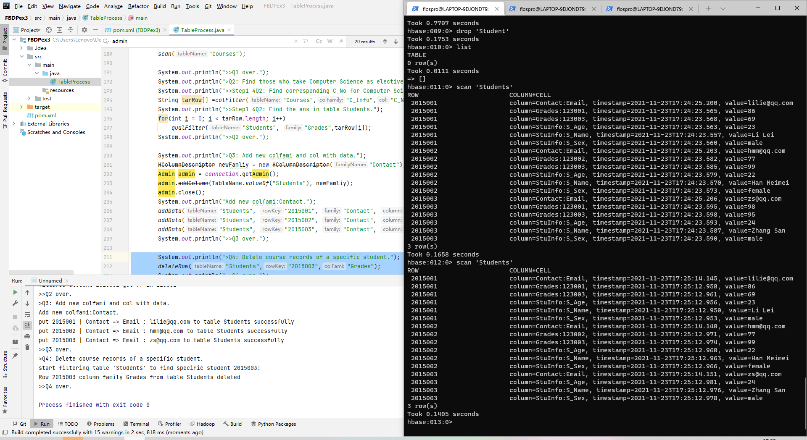

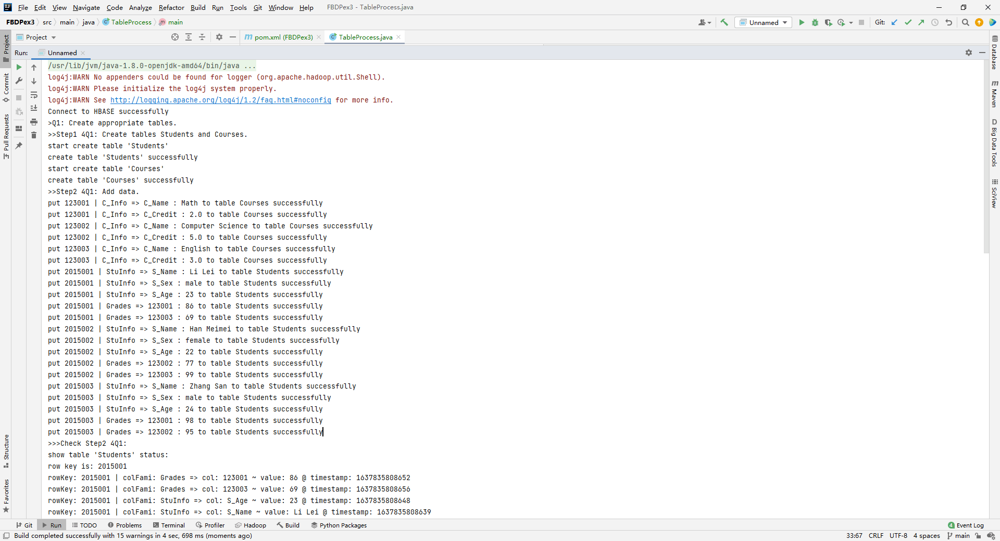

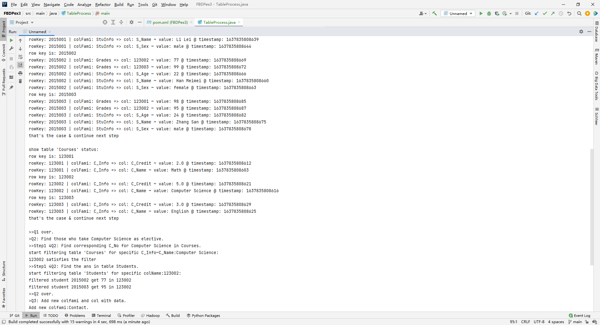

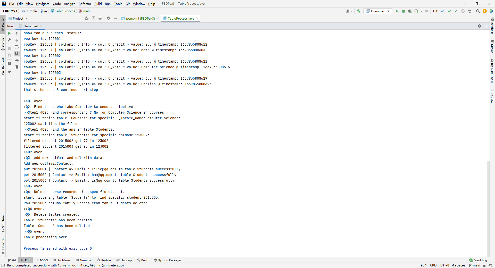

## 命令行逻辑

​		参考教程http://c.biancheng.net/hbase/。命令行代码在hbase_bat.txt文件中。

1. ####   设计并创建合适的表；

   ​		创建表格：

   ```shell
   create 'Students','Stulnfo','Grades'
   create 'Courses','C_Info'
   ```

   ​		插入数据示例：

   ```shell
   put 'Courses','123003','C_Info:C_Name','English'
   put 'Courses','123003','C_Info:C_Credit','3.0'
   put 'Students', '2015001', 'Stulnfo:S_Name', 'Li Lei'
   put 'Students', '2015001', 'Stulnfo:S_Sex', 'male'
   put 'Students', '2015001', 'Stulnfo:S_Age', '23'
   put 'Students', '2015001', 'Grades:123001', '86'
   put 'Students', '2015001', 'Grades:123003', '69'
   ```

   ​		查看结果：

   ```shell
   scan 'Students'
   scan 'Courses'
   ```

2. ####   查询选修Computer Science的学生的成绩；

   ​		格式：scan '表名', { Filter => "过滤器(比较运算符, '比较器') }。这里由于表格设计，和Java实现时一样，是不方便使用一行解决的，主要是HBase并不支持join或嵌套查询，且这里中间结果只有一项，分成两步、在第二步中显式表现中间结果并没有回避根本问题。在实际应用中确实遇到多个中间结果的，集成Hive使用SQL语言查询是比较合理的解决办法。

   ```shell
   scan 'Courses', FILTER => "SingleColumnValueFilter('C_Info', 'C_Name', =, 'binary:Computer Science')"
   scan 'Students', FILTER => "QualifierFilter(=,'binary:123002')"
   ```

3. ####  增加新的列族和新列Contact:Email，并添加数据；

   ​		先添加新列族，不需要disable表：

   ```shell
   alter 'Students','Contact'
   ```

   ​		插入数据：

   ```shell
   put 'Students','2015001','Contact:Email','lilie@qq.com'
   put 'Students','2015002','Contact:Email','hmm@qq.com'
   put 'Students','2015003','Contact:Email','zs@qq.com'
   ```

4. ####  删除学号为2015003的学生的选课记录；		

   ```shell
   get 'Students', '2015003', FILTER => "FamilyFilter(=, 'binary:Grades')"
   delete 'Students', '2015003', 'Grades:123001'
   delete 'Students', '2015003', 'Grades:123002'
   ```

   ​		因为hbase中没有shell命令能直接删除指定行的列族信息，所以需要先获取指定行的列族的所有列限定符，然后使用delete一个一个作删除，比Java代码直接对delete对象限制行键和列族进行删除繁琐一些。可以使用scan检查结果是否执行。

5. ####  删除所创建的表。

   ```shell
   disable 'Students'
   drop 'Students'
   disable 'Courses'
   drop 'Courses'
   ```

   ​		先禁用，再删除。可以使用list检查结果是否执行。

​		以下是运行截图（运行截图中第4问使用的是 alter  'Students',  {NAME=>'Grades', METHOD=>'delete'}命令是删除了所有Grades列族，是和题意删除特定行列族不符的失误，这里懒得改了，以代码文件为准 ）：

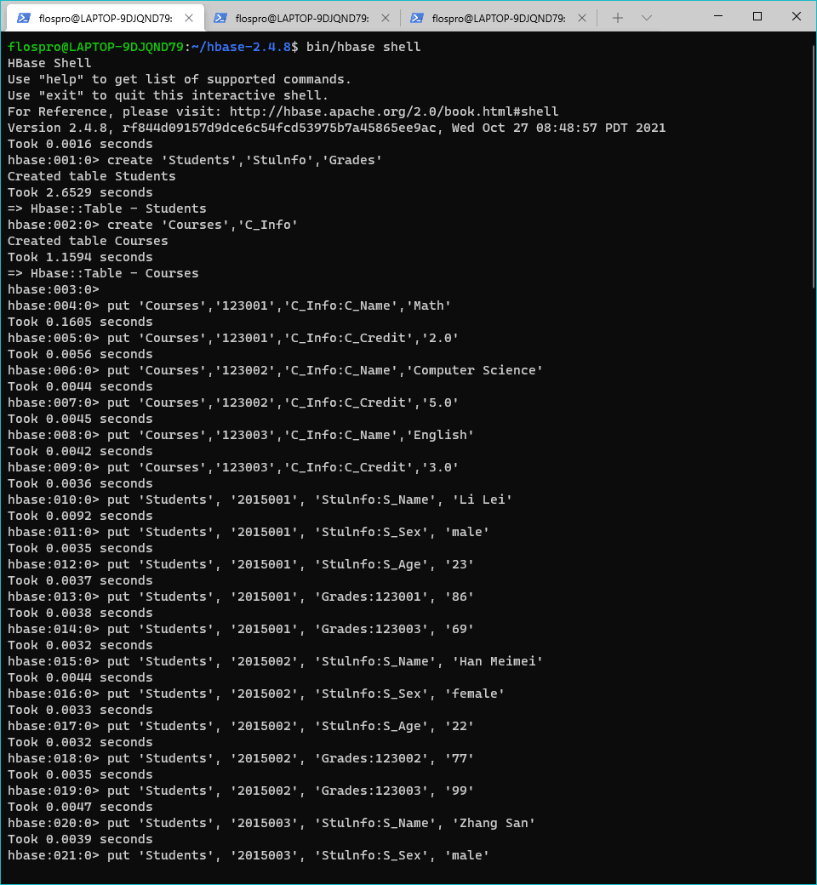

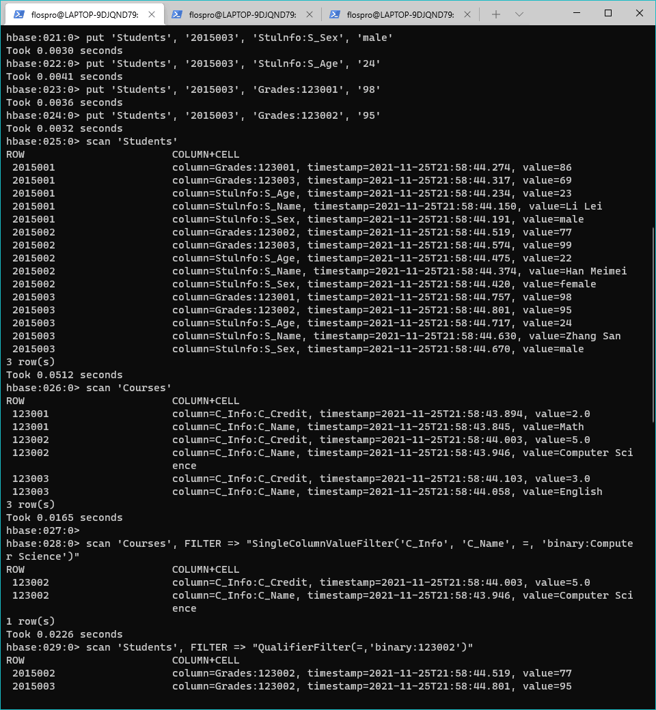

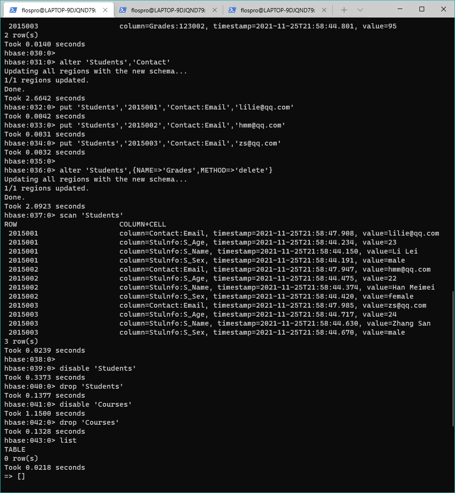

